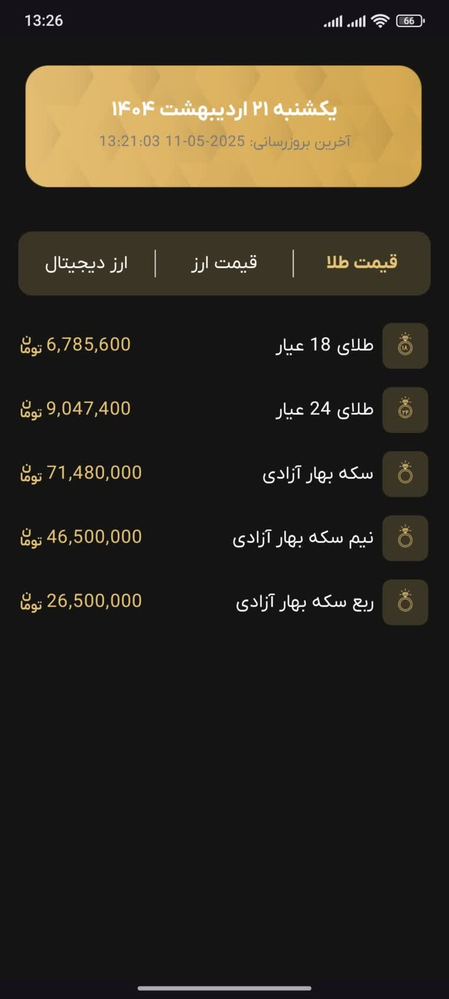
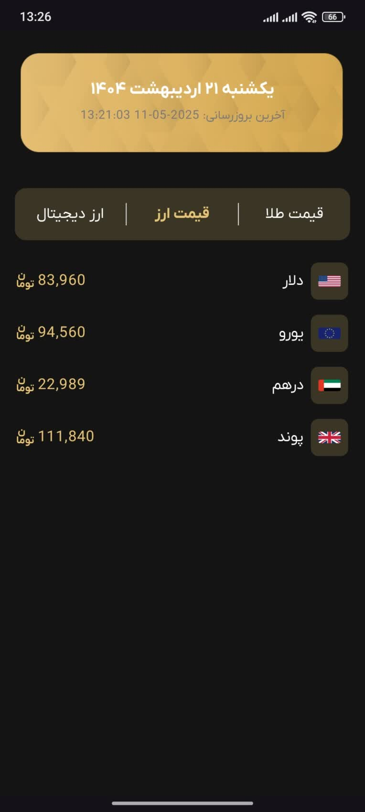
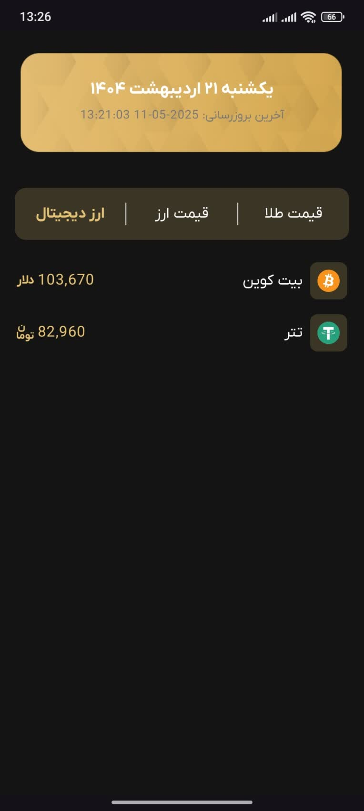

# Android Currency Tracker


A clean, modern, and lightweight Android application for tracking the real-time prices of gold, global currencies, and cryptocurrencies.

---

### Screenshots

A simple, tab-based UI allows users to quickly switch between different asset classes.

| Gold Prices | Currency Prices | Crypto Prices |
| :---: | :---: | :---: |
|  |  |  |

*(Note: The user interface is presented in Persian.)*

---

## 🌟 Key Features

-   **Real-Time Data:** Fetches the latest prices for gold, currencies, and cryptocurrencies from a public API.
-   **Modern UI:** A clean, single-screen interface built with Jetpack Compose and Material 3.
-   **Tabbed Navigation:** Easily switch between Gold, Currency, and Crypto views.
-   **Efficient Data Fetching:** Data for all tabs is fetched in a single network call upon startup.
-   **Custom Splash Screen:** A smooth startup experience with both system and custom splash screens.

---

## 🛠️ Tech Stack & Architecture

This project is built with a modern, scalable, and maintainable tech stack.

-   **UI Layer:** Built 100% with **Jetpack Compose (BOM 2024.04.01)** for a declarative and reactive user interface.
-   **Core Language:** **Kotlin (2.0.21)**
-   **Networking:**
    -   **Retrofit (2.11.0):** For type-safe handling of REST API calls.
    -   **OkHttp (4.12.0):** As the underlying HTTP client.
    -   **Gson (2.11.0):** For seamless serialization/deserialization of JSON data.
-   **Asynchronous Programming:** **Kotlin Coroutines** (via `LaunchedEffect`) for managing background threads and UI updates.
-   **Architecture:** Follows a clear **Repository Pattern** implemented as a **Singleton** to ensure a single source of truth for data and efficient resource management.

---

## 🚀 Setup & Installation

1.  **Clone the repository:**
    ```bash
    git clone https://github.com/shayansyn/Android-Currency-Tracker.git
    ```
2.  **Open in Android Studio:**
    -   Open the project in the latest version of Android Studio (e.g., Iguana or newer).
    -   Let Gradle sync and download all the specified dependencies from the `.gradle.kts` files.
3.  **Build and Run:**
    -   Build the project and run it on an Android emulator or a physical device.

---

### API Source

The data is fetched from the public API provided by `daneshjooyar.com`, which sources its data from `tgju.org`.
